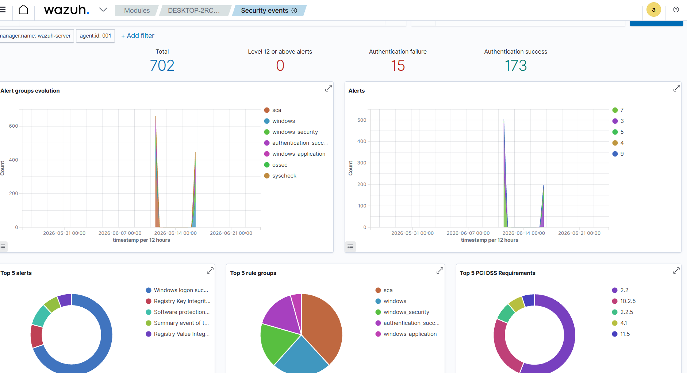

# 🛡️ SOC Detection Lab

> **A self-built Security Operations Center in miniature. Real attacks, real telemetry, real detection rules.**

By **Olayinka Abimbowo** — aspiring Junior SOC Analyst (Canada).

This lab is a **functioning purple-team environment** running on a single workstation. An attacker VM generates malicious activity, a Windows endpoint with Sysmon ships its logs to a Wazuh SIEM, and I write the detection rules that turn that telemetry into alerts. It is the exact loop a Tier-1 SOC analyst lives in, scaled down to fit on one laptop.

If you're a recruiter or hiring manager: **this lab demonstrates I can do the job before someone hires me to do it.** I'm not running a TryHackMe room — I'm running the platform.

**The payoff** — a real RDP brute-force launched from Kali, detected and classified by my SIEM as **MITRE ATT&CK T1110**:



---

## 🧱 The Lab

```
┌─────────────────┐         ┌──────────────────┐
│  Kali (attacker)│ ──────► │ Windows 11       │
│  nmap, Hydra    │ attacks │  + Sysmon        │   ← victim endpoint
│  (RDP brute-fc) │         │  + Wazuh agent   │
└─────────────────┘         └────────┬─────────┘
                                     │ telemetry
                                     ▼
                            ┌──────────────────┐
                            │  Wazuh Server    │   ← my SIEM
                            │  (Ubuntu)        │     rules, alerts,
                            └──────────────────┘     MITRE ATT&CK mapping
```

All three VMs run on an **isolated host-only network**. The attacker cannot reach the public internet or my home LAN — only the targets I tell it to attack.

---

## 🧪 Phases

### Phase 1 — [Lab Foundation](phase-1-lab-foundation/)
Building the three VMs (Ubuntu, Windows 11, Kali) on an isolated network in VirtualBox. Covers why lab isolation matters, how host-only networking works, and how to size VMs without starving the host. **✅ Complete.**

### Phase 2 — [SIEM Stand-up](phase-2-siem-standup/)
Installing Wazuh on the Ubuntu VM and touring the dashboard, decoders, and rules engine. Understanding what a SIEM *actually is* before connecting any agents. **✅ Complete.**

### Phase 3 — [Endpoint Telemetry](phase-3-endpoint-telemetry/)
Installing the Wazuh agent (alongside Sysmon + the SwiftOnSecurity config) on the Windows 11 endpoint. Verifying that Windows security events and Sysmon telemetry stream into Wazuh in real time — and re-isolating the victim afterward. **✅ Complete.**

### Phase 4 — [First Detection](phase-4-first-detection/)
Launching real attacks from Kali: an **Nmap recon scan** (and learning why a firewalled host with default logging evades a host-based SIEM — a real detection gap), then an **RDP brute-force with Hydra**. Watching Wazuh detect and classify it as **MITRE ATT&CK T1110 (Brute Force)**, and attributing it to the attacker's source IP. **✅ Complete.**

### Phase 5 — Custom Detection Rules
Writing custom Wazuh XML rules (e.g. brute-force threshold tuning, encoded PowerShell, suspicious child processes of Office) and tuning false positives. This is where the lab moves from "following along" to detection engineering. **⏳ Planned.**

### Phase 6 — [Investigation Writeup](phase-6-investigation-writeup/)
A full incident writeup of the Phase 4 brute-force, formatted like a real SOC ticket — summary, timeline, evidence, MITRE mapping, impact, and recommended response. **✅ First incident documented.**

---

## 🛠️ Skills Demonstrated

- **SIEM operations** — Wazuh manager, agent enrollment, rule writing, dashboard building
- **Endpoint telemetry** — Sysmon configuration, Windows event collection
- **Detection engineering** — writing rules, mapping to MITRE ATT&CK, tuning false positives
- **Adversary emulation** — Nmap reconnaissance, Hydra RDP brute-force, MITRE-aligned attacks from Kali
- **Investigation & attribution** — Windows event-log analysis (4625/4624), tracing attacks to a source IP, analyst-style triage
- **Lab architecture** — VirtualBox networking, network segmentation, safe handling of offensive tooling
- **Incident documentation** — analyst-style writeups recruiters and SOC managers actually read

**Tied to:** Google Cybersecurity Professional Certificate — Module 6 (Detection & Response) and ISC2 CC Domain 5 (Security Operations).

---

## 🧭 Why This Lab Exists

A SOC analyst's day is logs, alerts, and triage. You cannot demonstrate that you can do that work from a multiple-choice exam — you can only demonstrate it by running a real SIEM, ingesting real telemetry, and making real detections fire. This lab is my proof of work.

*This lab is actively being built — each phase ships with screenshots, walkthroughs, and the code/rules behind it. Star ⭐ to follow along.*
