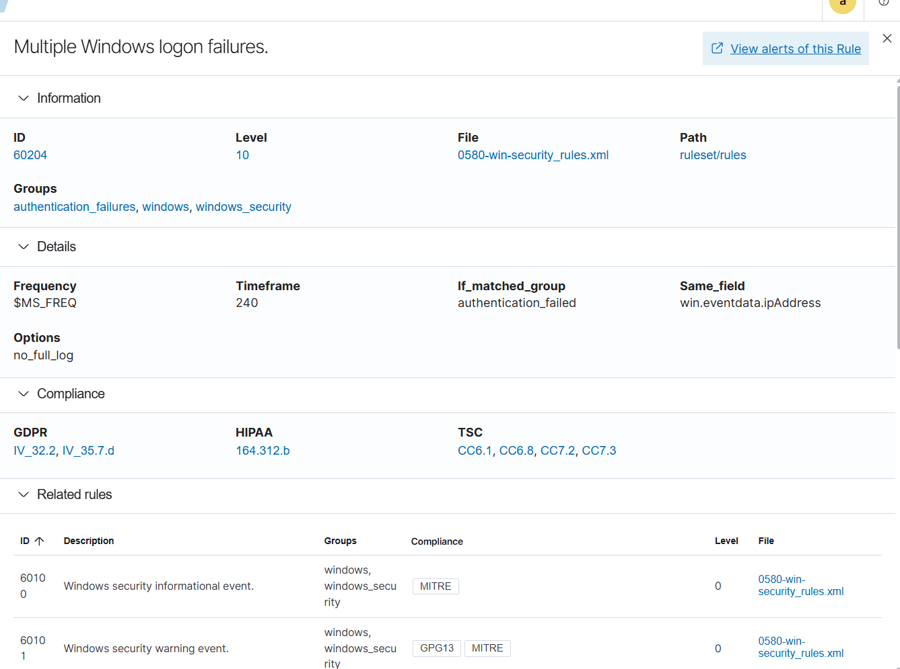
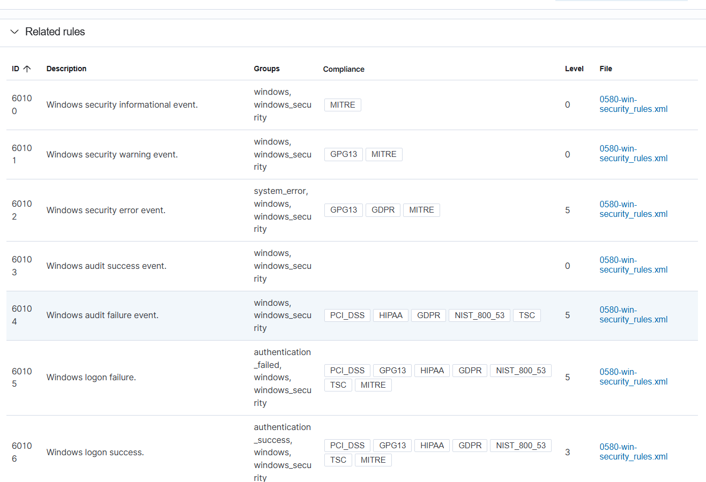
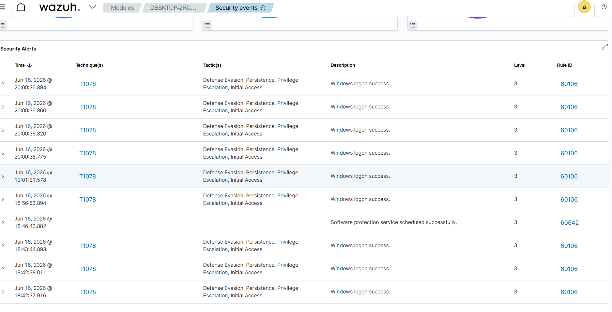
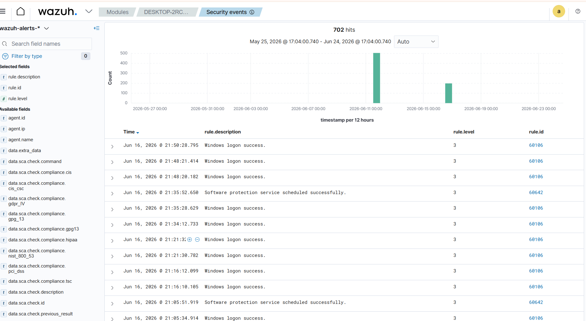

# Phase 4 — First Detection

> **Goal:** Launch real attacks from Kali against the Windows victim, and prove the SIEM detects, classifies, and attributes them. This is the payoff — the full **attack → log → detect → investigate** loop running end to end.

This phase ran two attacks back to back. The first one taught a lesson by **not** being caught. The second one lit up the dashboard with a textbook brute-force detection.

---

## 🎯 Attack 1 — Reconnaissance (Nmap), and a real detection gap

From Kali, the first move any attacker makes is recon:

```bash
nmap 192.168.56.102
```

**Result:**
```
Host is up (0.00072s latency).
All 1000 scanned ports ... filtered (no-response)
```

📸 `phase-4-nmap-scan.png`

### Reading the result
- **"Host is up"** — the victim is alive and reachable.
- **"1000 filtered ports (no-response)"** — the **Windows Firewall silently dropped** every probe. The attacker knows the host exists but can't enumerate services.

### The lesson: this scan produced **no Wazuh alert**
Windows doesn't log dropped firewall packets by default, so **no log = no event = no detection.** A basic recon scan against a firewalled host with default logging flies right past a host-based SIEM. **That is a real, important blind spot** — the kind you'd close with firewall logging or a network IDS (e.g. Suricata).

### Host visibility vs. network visibility
The Wazuh agent's inventory showed ports **135 / 139 / 445 listening** on the victim — but Nmap from the network saw them as **filtered**. Same machine, two truths:

| Tool | Vantage point | What it sees |
|---|---|---|
| Nmap (Kali) | Network / outside | Filtered — firewall blocks it |
| Wazuh agent | On the host | Ports are actually listening |

**This is exactly why SOCs deploy endpoint agents:** a network scan can be blinded by a firewall, but the agent living on the host sees the truth.

---

## 🔥 Attack 2 — RDP brute-force (and the detection that caught it)

To get an attack the SIEM *would* catch, we exposed a service the attacker could actually reach.

### Step 1 — Expose RDP on the victim
**Settings → System → Remote Desktop → On.** This opens port **3389** and auto-allows it through the firewall.

> *Why realistic:* exposed RDP is one of the most brute-forced services on the internet and a leading ransomware entry point. This recreates that exact attack path.

Verified listening on the victim:
```powershell
netstat -an | findstr 3389      # TCP 0.0.0.0:3389 ... LISTENING
```
📸 `phase-4-rdp-enabled.png`

### Step 2 — Brute-force from Kali with Hydra
```bash
printf '%s\n' password 123456 admin letmein Welcome1 Password1 qwerty WinUser > pass.txt
hydra -t 4 -V -l WinUser -P pass.txt rdp://192.168.56.102
```

- `-l WinUser` — the target account (note: lowercase **L** for **l**ogin, not the number 1)
- `-P pass.txt` — list of common passwords to spray
- 8 guesses, intentionally **wrong** — the *failures* are the point

📸 `phase-4-hydra-attack.png`

> All attempts fail (we're guessing) — and each failure writes a **Windows Event ID 4625 (failed logon)** on the victim, which the agent ships to the SIEM.

### Step 3 — The detection fires 🚨
On the dashboard (**Security Events**, filtered to the victim):

- **Authentication failure** counter jumped **2 → 17**
- **Top MITRE ATT&CK** now shows **Brute Force** and **Password Guessing** — that's **MITRE T1110**


| Rule | Meaning | Level |
|---|---|---|
| `60122` | Logon failure – unknown user or bad password (each attempt) | 5 |
| `60204` | **Multiple Windows Logon Failures** (the correlation alert) | **10** |

Rule **60204** is the smoking gun — Wazuh correlated many individual failures into a single *"someone is brute-forcing this box"* alert. That's the alert an analyst gets paged on. Here's that rule in the ruleset — it fires when many `authentication_failed` events share the **same `win.eventdata.ipAddress`** inside a **240-second** window, which is exactly the shape of a brute-force:



<details><summary>More dashboard views from this detection</summary>

The related Windows-security rules that feed the correlation (individual *logon failure* rules → `60204`):



The security-alerts timeline for the endpoint during the attack window:



The raw events explorer (702 events over 30 days) — the underlying data the alerts are built from:



</details>

---

## 🔍 Investigation — attributing the attack

A detection isn't the end; an analyst **scopes and attributes** it. By building a Wazuh **visualization** of source IPs (`data.win.eventdata.ipAddress`), the attack traced straight back to its origin:

| Source IP | Count | What it is |
|---|---|---|
| **192.168.56.104** | ~11 | 🚨 **The attacker — Kali** (the brute-force) |
| `127.0.0.1` | ~3 | localhost — normal local logons |

📸 `phase-4-source-ip-attribution.png`

**One chart answers "who, and how many times":** the hostile source was `192.168.56.104`, responsible for the failed-logon spike. In a real incident this is what you hand the team.

---

## 🧯 Gotchas hit during this phase
- **`hydra -1` vs `-l`** — the login flag is a lowercase **L** (for login), not the number **1**. The `-1` typo produced `invalid option -- '1'`.
- **Windows 11 RDP uses NLA**, which can make Hydra's RDP module slow — be patient; the attempts still land.
- **Isolated VMs can't NTP-sync**, so the victim's clock drifted. It had to be set manually (`Set-Date`) so attack timestamps line up on the timeline.
- **Enabling RDP via PowerShell alone left 3389 not listening** — the **Settings → Remote Desktop toggle** reliably brings up the listener *and* the firewall rule.

---

## ✅ Phase 4 "done" looks like
- [x] Recon attack (Nmap) run — and understood **why it wasn't detected** (firewall + default logging = blind spot)
- [x] RDP exposed; brute-force launched from Kali with Hydra
- [x] SIEM detected it: auth-failure spike + **MITRE T1110** (Brute Force / Password Guessing), rule **60204**
- [x] Attack **attributed** to source IP `192.168.56.104` via a custom visualization

---

> 📸 _Still to capture from the Kali VM:_ the Nmap scan output (`phase-4-nmap-scan.png`), the Hydra brute-force running (`phase-4-hydra-attack.png`), and the source-IP attribution chart (`phase-4-source-ip-attribution.png`). The detection side is fully evidenced above.

---

## ➡️ Next
**[Phase 6 — Investigation Writeup](../phase-6-investigation-writeup/):** the full incident report for this brute-force, written like a real SOC ticket.
